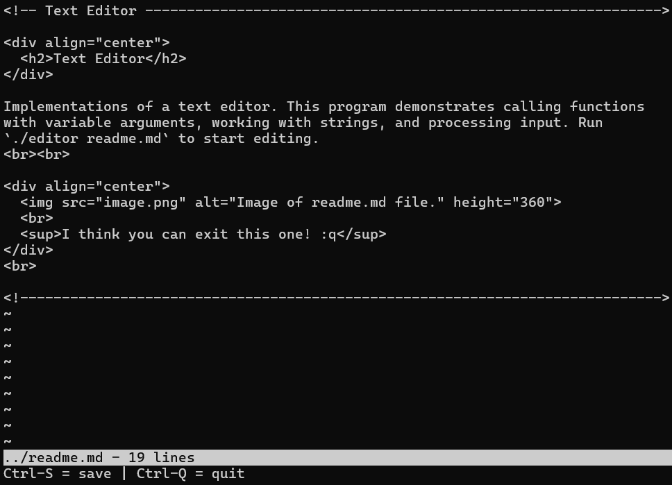

<!-- Text Editor -------------------------------------------------------------->

  <h2>Text Editor</h2>

Implementations of a text editor. This program demonstrates calling functions
with variable arguments, working with strings, and processing input. Run
`./editor readme.md` to start editing.
  

  
   
  I think you can exit this one! :q

 

Many thanks to <a href="https://github.com/snaptoken">snaptoken</a>'s
<a href="https://github.com/snaptoken/kilo-tutorial">Build Your Own Text Editor</a>
for providing the basis for these implementations.

<!----------------------------------------------------------------------------->
