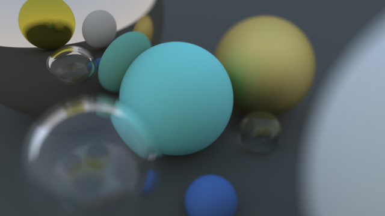

<!-- Ray Tracer --------------------------------------------------------------->

  <h2>Ray Tracer</h2>

Implementations of a ray tracer. This program demonstrates the use of recursion,
multithreading, inheritance and polymorphism where supported by the language.
Run `./raytracer` to ray trace the scene shown below. You can open the output
file `image.ppm` on
[this website](https://www.cs.rhodes.edu/welshc/COMP141_F16/ppmReader.html).
  

  
   
  Ray traced with 2000 samples per pixel with recursion depth of 200.

 

Many thanks to the authors of
<a href="https://github.com/RayTracing/raytracing.github.io">Ray Tracing in One Weekend</a>
for providing the basis for these implementations.

<!----------------------------------------------------------------------------->
