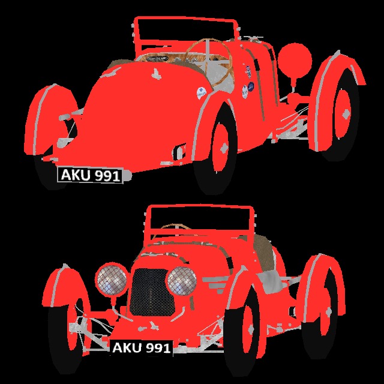

<!-- Renderer ----------------------------------------------------------------->

  <h2>Renderer</h2>

Implementations of a renderer. This program demonstrates handling errors,
processing command line arguments, and working with binary files. Run
`./renderer front.obj back.obj` to render two Aston Martin models I created
during a bachelor course at [FEE CTU](https://fel.cvut.cz/en).
  

  
   
  1935 Aston Martin 1.5-litre Ulster

 

Many thanks to <a href="https://github.com/ssloy">Dmitry V. Sokolov</a>'s
<a href="https://github.com/ssloy/tinyrenderer">Tiny Renderer</a>
for providing the basis for these implementations.

<!----------------------------------------------------------------------------->
